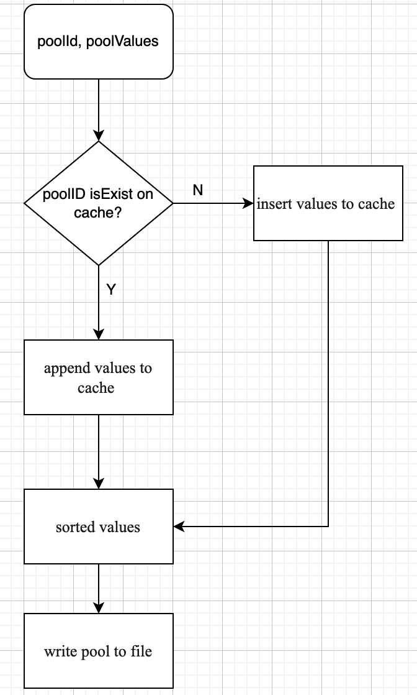
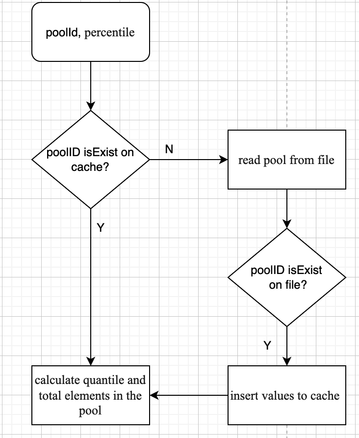
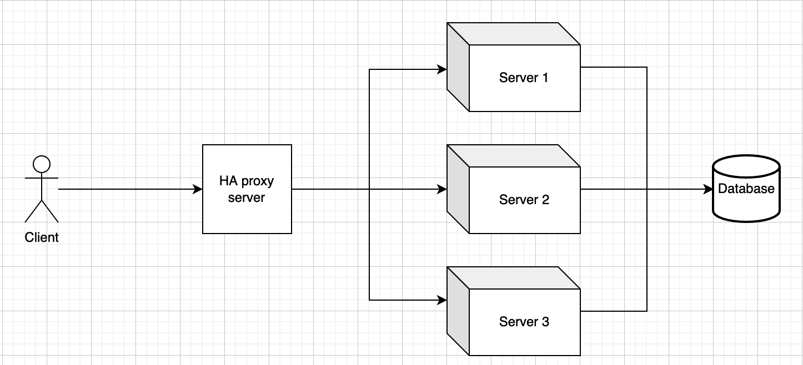

# Document
### Giới thiệu
- Project xây dựng 2 services quản lý danh sách các pool và tính quantile của pool.
- Danh sách pool sẽ được lưu tối đa 100 pool trên cache và sẽ tồn tại trong 5 phút tính từ thời gian access.
- Sau khi lưu pool vào cache thì sẽ sorted các phần tử trong pool theo thứ tự tăng dần.
- Lưu pool xuống file để tăng khả năng resiliency, tránh tràn cache và dùng để khởi tạo cache khi service start.
- Khi có nhu cầu truy vấn, tính quantile trên 1 pool thì đầu tiên ta sẽ truy cập
  đến cache, nếu trong cache không có pool thì sẽ đọc file để lấy pool.
### Tối ưu
- Sử dụng remote cache (redis/aerospike) thay vì in memory để có thể nhất quán dữ liệu giữa các servers.
- Để high-availability và scalability service thì ta sẽ deploy service trên nhiều servers khác nhau và
  sử dụng HA proxy để điều phối request đến các servers.

### Flow chart
- Sơ đồ miêu tả luồng xử lý api 1 - lưu pool theo ID
  
- Sơ đồ miêu tả luồng xử lý api 2 - tính quantile pool
  
- Triển khai high-availability and scalability cho services
  

# Instructions
- Project được xây dựng bằng maven và sử dụng spring framework để phát triển các REST API.
  Để build service, ta chạy command:
> mvn clean install 
- Sử dụng command sau để start service, mặc định port 8080 được sử dụng:
> java -cp target/homework-0.0.1-SNAPSHOT.jar com.tech.homework.HomeworkApplication
- Sử dụng curl để query service
  - Endpoint 1 - Lưu pool: 
  ```
  curl -X POST http://localhost:8080/api/v1/pool -H 'content-type: application/json' \
  -d '{
  "poolId": 123456,
  "poolValues":[1,7,2,6]
  }'
  ```
  - Endpoint 2 - Tính quantile
  ```
  curl -X POST http://localhost:8080/api/v1/quantile -H 'content-type: application/json' \
  -d '{
  "poolId": 123456,
  "percentile":25
  }'
  ```